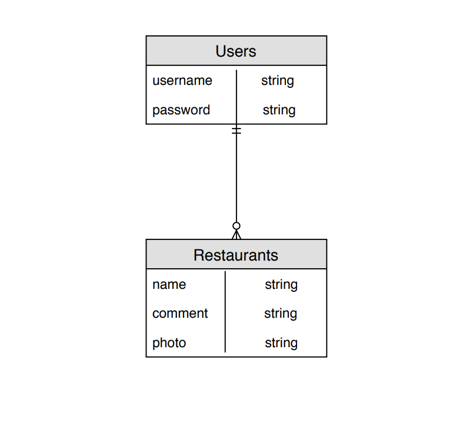

# [EATT](http://eatt.surge.sh/)

# Description
## This is an app that allows you to create your favorite restaurant on the website. It was created with a React front-end and Ruby on Rails back-end.

# Entity Relationship Diagram

# Installation Instructions

1) Open up the app:

   $ cd eatt_app

2) Now run the installers:

   $ bundle install

3) Start the rails server:

   $ rails s

4) Get the react to work:

   $ cd client

5) Install react-router-dom:

   $ npm i react-router-dom

6) Install jwt-decode:

   $ npm i jwt-decode 

7) Let's start the app:

   $ npm start

# Acknowledgements
This game was made as part of General Assembly's Web Development Immersive. 

Thank you to our instructors Bruno Galvao, Leonardo Rodriguez, and David Whitlatch.

